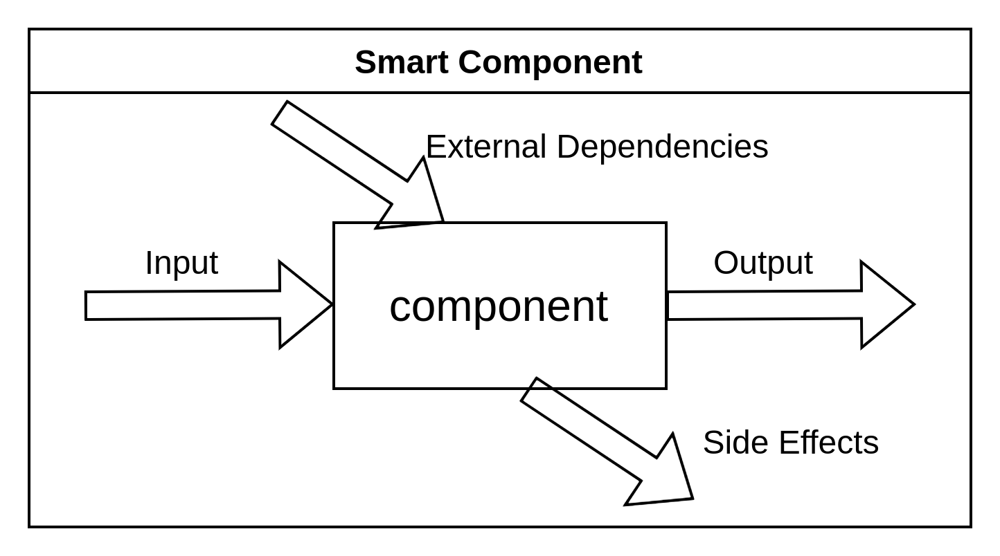
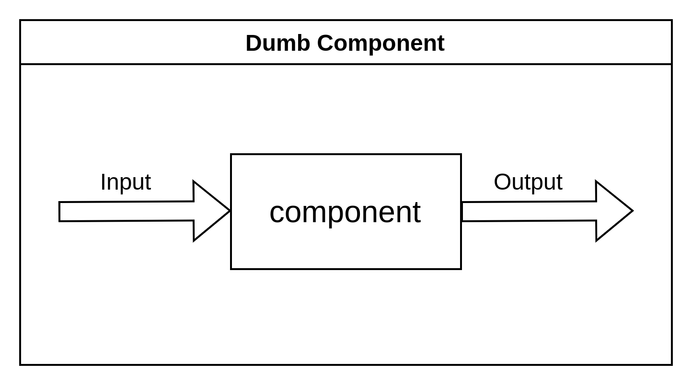

# Component architecture
In this repository you will find information what is component architecture on frontend and techniques. We hope that this allow you create code less prone to bugs, easier to maintain and provide better developer experience.

## Component Types
Component architecture consists of multiple patterns of components categorization. First and frequently used is Container/Presentational Pattern. Next is segregation for Screen Components and Shared Components.
### Screen/Page/View Components
They are directly matched with routing and are responsible for composing other components to display a screen. Only those components should take data from the URL and pass them further.
If this component takes and passes URL data it becomes a Smart Component. If not - dumb.
Those components should be as simple as possible.
Those types of components can be also called Views Components.
### Container Components
### Presentational Components
### Smart Components

### Dumb Components

### Stateful Components
### Stateless Components
### Compound Components
### Higher Order Components
### Server Components

## Testing components
### Jest
### Storybook
### Cypress
### Playwright